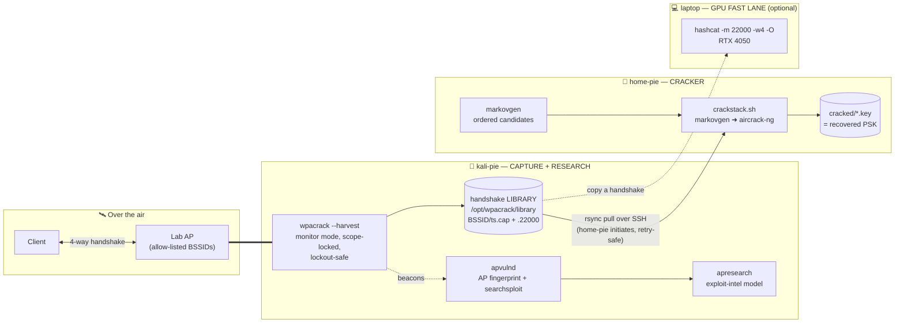
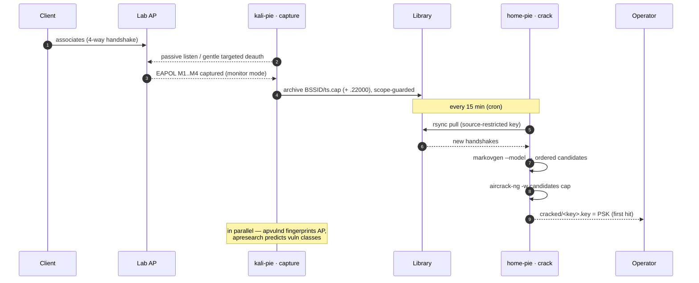
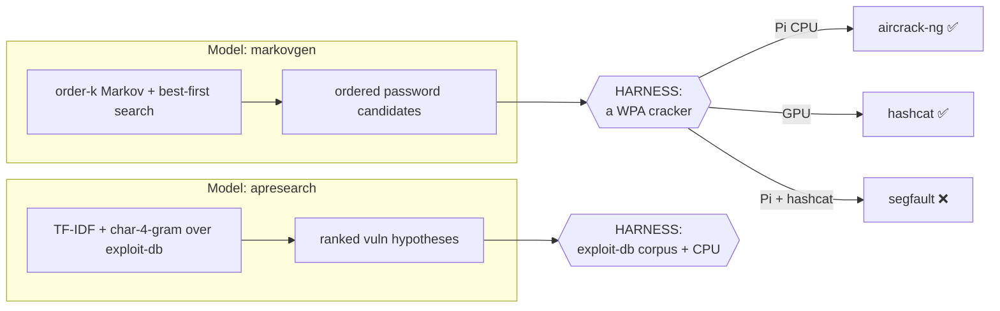
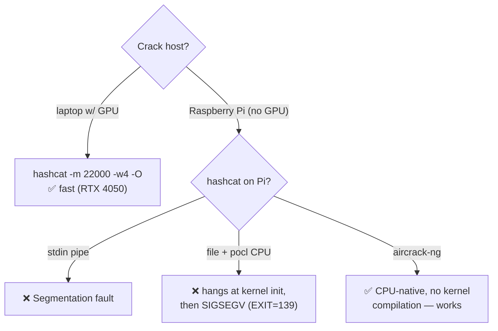
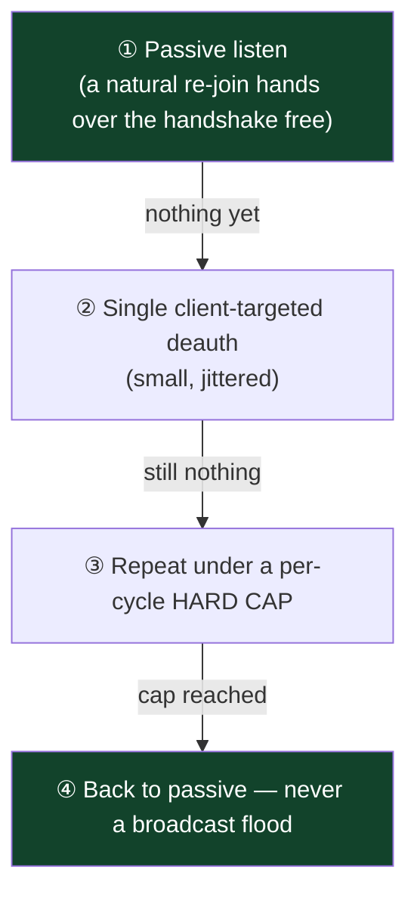
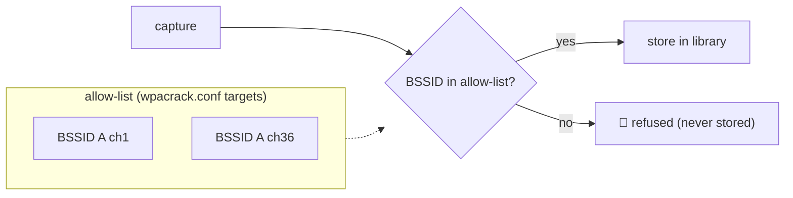
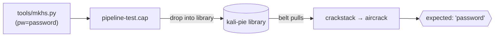

# 📡 Pipeline — Distributed WPA Capture → Crack → Research

A self-hosted, **authorized-lab** security pipeline that splits WPA testing across three machines,
each doing the workload it is actually good at, and moves small artifacts (handshakes, fingerprints)
between them over SSH.

> ⚠️ **Authorized use only.** Every component is hard-scoped to the operator's own access point (a
> BSSID allow-list). This is a defensive / research tool for networks you own or are explicitly
> permitted to test. It performs **no online guessing and no WPS-PIN brute** — cracking is 100%
> offline, so it can never trip an AP lockout.

📖 **[`DESIGN.md`](DESIGN.md)** holds the deep theory; this README is the detailed, visual tour.

---

## Table of contents
- [Why split it across three machines?](#-why-split-it-across-three-machines)
- [Architecture at a glance](#-architecture-at-a-glance)
- [End-to-end data flow](#-end-to-end-data-flow)
- [The core theory: models need a harness](#-the-core-theory-models-need-a-harness)
- [Why aircrack-ng and not hashcat on the Pi](#-why-aircrack-ng-and-not-hashcat-on-the-pi)
- [Component deep-dives](#-component-deep-dives)
- [The no-lockout escalation ladder](#-the-no-lockout-escalation-ladder)
- [crackstack internal logic](#-crackstack-internal-logic)
- [Scope & security model](#-scope--security-model)
- [Repository layout](#-repository-layout)
- [Deploy & run](#-deploy--run)
- [Testing end-to-end](#-testing-end-to-end)
- [Status matrix](#-status-matrix)
- [Roadmap](#-roadmap)
- [Cloud crack fast-lane (VPS / GPU cloud)](#️-cloud-crack-fast-lane-vps--gpu-cloud--options--cost)

---

## 🧩 Why split it across three machines?

Cracking WPA is really **three different workloads**, and one box is rarely good at all three:

| Workload | Wants | Poor fit | Placed on |
|---|---|---|---|
| **Capture** a 4-way handshake | monitor-mode radio, RF proximity, patience | a rack GPU | **kali-pie** (capture appliance) |
| **Crack** the handshake | raw compute — WPA2 = PBKDF2-HMAC-SHA1 ×4096 | a headless Pi CPU | **home-pie** (Pi) + **laptop GPU** (fast lane) |
| **Research** the AP's vulns | an exploit corpus + spare CPU for inference | any host without the data | **kali-pie** (relocatable) |

The pipeline puts each workload where it belongs and ships only tiny artifacts between hosts.

---

## 🗺️ Architecture at a glance



**Trust & transport:** home-pie **pulls** (it initiates) over SSH with a dedicated, passphrase-free,
**source-restricted** key authorized on kali-pie. Pull-model = survives home-pie being powered off,
and a dropped link just retries next cycle instead of losing data.

---

## 🔄 End-to-end data flow



---

## 🧠 The core theory: models need a harness

The system has **two models** — both pure, portable Python — but a model only produces *inputs*.
It needs a working **harness** on its host to turn those inputs into results:



**Takeaway:** picking the right harness *per host* is where the engineering lives — and where the
surprises were (below).

---

## ⚙️ Why aircrack-ng and not hashcat on the Pi

hashcat is the obvious cracker — but on a **GPU-less Raspberry Pi** it drives the CPU through `pocl`
(OpenCL), and that path is broken here:



| Attempt on the Pi | Result |
|---|---|
| `markovgen \| hashcat` (stdin) | **Segmentation fault** |
| `hashcat -m 22000 file` (pocl CPU) | stuck at *"Initializing device kernels…"*, then **EXIT=139** (SIGSEGV) even after 6 min |
| `aircrack-ng -w file cap` | ✅ **`KEY FOUND!`** (verified against a synthetic handshake) |

➡️ **Decision:** `aircrack-ng` is the Pi's harness; `hashcat` stays on the GPU fast-lane.

---

## 🔬 Component deep-dives

### 1. `wpacrack --harvest` — capture appliance (kali-pie)
| Property | Detail |
|---|---|
| Mode | Sets monitor mode **once** and holds it (bouncing NetworkManager per cycle previously wedged the Pi's SSH) |
| Scope | Only allow-listed BSSIDs; `archive()` **refuses** any other BSSID — enforced in code |
| Politeness | Passive-first; then small, jittered, **client-targeted** deauth under a per-cycle hard cap; no floods |
| Output | `library/<BSSID>/<ts>.cap` (+ `.22000` via `hcxpcapngtool`), plus an index; idles when targets are fresh |

### 2. Conveyor belt — `crackstack` pull (home-pie)
`rsync` over SSH, **home-pie initiates**. Key is passphrase-free and `from="<home-pie IPs>"`
restricted on kali-pie (least privilege, one direction). `rsync` failure is non-fatal → retry next cron.

### 3. `crackstack.sh` — the Pi cracker (home-pie)
`markovgen` candidates → `aircrack-ng`. First-hit-wins. Hardened (see [logic](#-crackstack-internal-logic)).

### 4. `markovgen` — candidate model → [Markovgen-Model](https://github.com/Blitswolf/Markovgen-Model)
Order-k character Markov model + **best-first (uniform-cost) search** = candidates in *descending
probability order*; generates novel plausible passwords a static list can't, respects WPA's 8-char
minimum, seedable.

### 5. `apresearch` — exploit-intel model → [Apresearch-Model](https://github.com/Blitswolf/Apresearch-Model)
When `searchsploit` finds nothing, it reasons over the **whole** exploit-db (TF-IDF + char-4-gram)
→ nearest analogues → predicted vuln classes → mined endpoint/param/payload **test plan**. Runs
continuously at low priority to use spare CPU.

### 6. `apvulnd` — AP recon (kali-pie)
Hourly: fingerprints the AP from beacons (vendor / WPS / RSN / PMF / cipher), runs `searchsploit`,
feeds `apresearch`, and — only when the AP mgmt IP is reachable — a bounded **non-destructive**
sweep. Recon only; no brute.

---

## 🛡️ The no-lockout escalation ladder

Capture escalates gently and can **never** trip an AP lockout (no online guessing anywhere):



Cracking is **entirely offline** → the AP is never sent a single password guess.

---

## 🧷 crackstack internal logic

The hardening that makes it *immaculate* for unattended operation:


> 🔑 **The critical fix:** `tried` is marked **only after a completed attempt**. An earlier version
> marked it *before* cracking, so any crash / kill / reboot mid-crack silently burned the handshake
> forever. Now a crashed run leaves it un-tried and it is retried next cycle.

---

## 🔐 Scope & security model



- Capture is allow-listed **and** the archiver refuses off-list BSSIDs.
- No online password guessing, no WPS-PIN brute → no lockout, anywhere.
- Cross-host trust: one-directional, passphrase-free, **source-restricted**, least privilege.
- **Nothing sensitive is committed** — real configs, captures, keys, and models are git-ignored.

---

## 🗂️ Repository layout

```
Pipeline/
├── DESIGN.md                      architecture, theory, proven/limited status
├── README.md                      this file
├── capture/                       kali-pie
│   ├── wpacrack.py                  single-shot + --harvest continuous library mode
│   ├── wpacrack-harvest.service     systemd unit
│   └── wpacrack.conf.example        site config (allow-list, library, cooldown) — placeholders
├── crack/                         home-pie
│   └── crackstack.sh                pull → markovgen → aircrack-ng, hardened
├── research/                      kali-pie (relocatable)
│   ├── apresearch.py                exploit-intel model
│   ├── apresearch.service           continuous low-priority service
│   ├── apvulnd.py                   AP fingerprint + searchsploit + discovery
│   ├── apvuln.service
│   └── apvuln.timer
└── tools/
    └── mkhs.py                      synthetic WPA2 handshake generator (for e2e testing)
```

`markovgen` lives in its own repo and is deployed alongside `crackstack.sh` on the cracker.

---

## 🚀 Deploy & run

**Capture (kali-pie):**
```bash
sudo install -m755 capture/wpacrack.py /opt/wpacrack/wpacrack.py
sudo cp capture/wpacrack.conf.example /opt/wpacrack/wpacrack.conf   # edit: your AP allow-list
sudo cp capture/wpacrack-harvest.service /etc/systemd/system/
sudo systemctl enable --now wpacrack-harvest        # monitor-mode capture into the library
```

**Cracker (home-pie):**
```bash
mkdir -p ~/crackstack/model
cp crack/crackstack.sh ~/crackstack/ && chmod +x ~/crackstack/crackstack.sh
# + markovgen.py and a trained model into ~/crackstack/{,model/}
crontab -l | { cat; echo "*/15 * * * * /home/labs/crackstack/crackstack.sh"; } | crontab -
```

**Research (kali-pie):**
```bash
sudo cp research/apresearch.py research/apvulnd.py /opt/apvuln/
sudo cp research/apresearch.service research/apvuln.service research/apvuln.timer /etc/systemd/system/
sudo systemctl enable --now apresearch.service apvuln.timer
```

**GPU fast-lane (laptop):**
```bash
hashcat -m 22000 -w4 -O <handshake.22000> <wordlist>      # orders of magnitude faster than a Pi
```

---

## 🧪 Testing end-to-end

`tools/mkhs.py` builds a **valid synthetic WPA2 4-way handshake** for a chosen password (default
`password`, ESSID `PIPELINE-TEST`) — no real client needed:



Verified locally: `aircrack-ng` cracks the generated handshake → `KEY FOUND! [ password ]`.

---

## 📊 Status matrix

| Component | State | Notes |
|---|---|---|
| Capture appliance (harvest) | ✅ working | headless, scope-locked, lockout-safe |
| Conveyor belt (pull) | ✅ working | source-restricted key, retry-safe (when link is up) |
| aircrack harness | ✅ proven | cracks handshakes natively on the Pi CPU |
| **live crack on home-pie** | ✅ **proven** | candidate-file + aircrack → `KEY FOUND! [ password ]` at ~46–95k keys/s |
| Pi candidate-file fix | ✅ done | 1.24M ordered candidates pre-generated + shipped; **no model-load at crack time** |
| apresearch model | ✅ working | 47k-entry index, vuln-class predictions |
| **home-pie Wi-Fi link** | ⚠️ unreliable | drops frequently → **put home-pie on Ethernet** (the one remaining caveat) |
| markovgen live-gen on a Pi | ⚠️ superseded | heavy on ARM → replaced by the pre-generated candidate file; live model kept as a fallback |
| hashcat on a Pi | ❌ unusable | pocl CPU kernel-init segfault → aircrack instead |

---

## 🧭 Roadmap
1. **home-pie → Ethernet** — the one remaining reliability caveat.
2. ✅ ~~Lighter model on the Pi~~ — **done**: pre-generated candidate file shipped; live crack proven.
3. Unattended cron belt run end-to-end once home-pie is on a stable link.
4. Optional: relocate `apresearch` onto home-pie to scale the research side.
5. **Cloud GPU crack fast-lane** — a rented GPU as the ultimate crack harness → see next section.
6. Commit `markovgen.py` + the refined `crackstack` here.

---

## ☁️ Cloud crack fast-lane (VPS / GPU cloud) — options & cost

A rented GPU is just **another crack harness** in the fast-lane (same role as the laptop, but bigger):
capture on the Pi → ship the tiny `.22000`/`.cap` → run `hashcat -m 22000` on the cloud GPU → get the
PSK → **destroy the instance**. Handy for big wordlist/rule runs the Pi (or laptop) would grind on.

WPA2 (mode `22000`) is a *slow* hash (PBKDF2-HMAC-SHA1 ×4096), so the number that matters is
`hashcat -m 22000` throughput. Reference points from this project: **Pi aircrack ≈ 50–95 kH/s**,
**laptop RTX 4050 ≈ 325 kH/s**.

| Provider | Example GPU | ~m22000 speed | ~On-demand $/hr | Best for |
|---|---|---:|---:|---|
| **Vast.ai** (marketplace) | RTX 4090 | ~1.8–2.2 MH/s | **~$0.30–0.55** | cheapest per-crack; interruptible/spot |
| **RunPod** (community cloud) | RTX 4090 | ~1.8–2.2 MH/s | ~$0.34–0.70 | ready hashcat templates, easy spin-up |
| **Linode / Akamai GPU** | RTX 4000 Ada | ~0.9–1.1 MH/s | ~$0.52 (per GPU) | predictable, managed, hourly-billed |
| **Linode / Akamai GPU** | RTX 6000 Ada (dedicated) | ~2.3–2.6 MH/s | ~$1.50 | heavier managed runs |
| **AWS EC2** | `g6`/`g5` (L4 / A10G) | ~0.5–0.9 MH/s | ~$0.80–1.00 (spot ~⅓) | already in AWS; scriptable spot |
| **AWS EC2** | `g4dn` (T4) | ~0.2 MH/s | ~$0.53 (spot ~$0.16) | cheapest AWS, slower |
| **Paperspace** | A4000 / RTX 5000 | ~0.5–0.9 MH/s | ~$0.51–0.76 | notebook-style, managed |
| **Lambda** | A100 40 GB | ~1.4–1.6 MH/s | ~$1.10 | when A100/H100 are idle-priced |

> 💷 **Prices are approximate (early 2026) — always check current rates.** Marketplace (Vast/RunPod)
> is cheapest but interruptible; Linode/AWS are steadier but pricier. Multi-GPU scales throughput
> ~linearly if you're impatient.

### What a crack actually costs (it's the wordlist, not the GPU-hour)
On a ~2 MH/s GPU (e.g. a $0.40/hr RTX 4090):

| Attack | Keyspace | Time | Cost |
|---|---:|---:|---:|
| rockyou (14 M) | 14 M | ~7 s | **≈ $0.00** |
| rockyou × `best64` rules | ~1.1 B | ~9 min | ~**$0.06** |
| big combined list + rules | ~10–50 B | ~1.5–7 h | ~**$0.60–$3** |
| full 8-char brute force | ~6 × 10¹³+ | months–years | **infeasible at any budget** |

**Recommendation for this pipeline:**
- **Occasional authorized cracks → Vast.ai or RunPod RTX 4090** (~$0.30–0.55/hr): spin up, run the
  list, tear down — a typical crack costs *pennies*.
- **Want it managed / same ecosystem as your other infra → Linode GPU** (RTX 4000 Ada ~$0.52/hr;
  RTX 6000 Ada ~$1.50/hr). Simplest hourly billing, no marketplace variance.
- **Already on AWS →** `g6`/`g5` **spot** instances with an auto-teardown script.
- Feed the cloud box the **`.22000`** the Pi produces (`hcxpcapngtool`), or use `markovgen` to stream
  ordered candidates into cloud hashcat for smarter-than-a-wordlist runs.

### 🔎 Evidence-based estimate for *this* handshake

The real lab handshake has already survived a lot of work — and that record **is** the evidence:

| Attack already tried | Keyspace | Result |
|---|---:|---|
| rockyou (14 M) | 1.4 × 10⁷ | ❌ exhausted, no hit |
| targeted seed list (name + digits/years) | ~10⁴ | ❌ miss |
| combined 41 M-corpus markov, ~2.6 M ordered candidates | 2.6 × 10⁶ | ❌ miss |
| rockyou × `best64` / `d3ad0ne` rules | ~10⁹ | ❌ miss |

**What that rules out:** not a common leaked password, not a simple name+digits, not in the top few
million most-probable human passwords *or* their common mangles. So the PSK is **high-entropy — a long
and/or non-dictionary passphrase.** (The prior key was a name+digits password; the post-rename key is
clearly stronger.)

**Cost by remaining scenario** (rented RTX 4090 ≈ 2 MH/s @ ~$0.40/hr):

| If the PSK is… | Approach | Time (1× 4090) | ~Cost | Verdict |
|---|---|---:|---:|---|
| a *harder* human password (big-leak / heavy mangle) | `weakpass_4` (~10¹⁰) + a strong ruleset | ~1.5 h – ~1 day | **~$1–$10** | ✅ worth a bounded try |
| a 4-word passphrase / uncommon structure | combinator · PRINCE · targeted masks | ~hours–days | ~$5–$40 | ⚠️ low-confidence, only with a hunch |
| ≥10-char effectively random (a–z0–9) | brute force (≥3.6 × 10¹⁵) | ~decades on 1 GPU | **$10k–$100k+** | ❌ uneconomic — don't |

**Recommended approach (evidence-driven):**
1. **One bounded cloud run, budget ≈ $10–$30.** Rent a Vast.ai / RunPod **RTX 4090** and run
   **`weakpass_4` + `OneRuleToRuleThemAll`**, optionally streaming `markovgen` order-4 candidates as a
   supplement. This is the *last economically sane* dictionary-class attempt — the only tier with real
   upside left.
2. **If that misses → stop cracking.** The evidence says the key is high-entropy; brute force is
   decades and five-figure sums. Pivot to the **non-crypto attack surface** (that's precisely what
   `apvulnd` + `apresearch` exist for — AP firmware / management-plane vulns), or accept the network as
   well-secured.

**Expected outcome for this specific handshake:** most likely **not cracked** even after the ~$10–$30
run, since everything tractable has already missed. So the honest expected spend is **~$10–$30 to
*confirm* it's uncrackable**, not an open-ended bill — treat a hit as a pleasant surprise, not the base case.

### ⚠️ Before you rent
- **Authorized handshakes only.** Nearly every provider's ToS forbids unauthorized attacks — only
  crack networks you own or are permitted to test.
- **Upload the handshake, nothing else** (no identifying context); **destroy the instance** after use.
- Prefer **spot/interruptible + a teardown timer** so a forgotten instance can't run up a bill.

---

*Related: [WPAcrack.py](https://github.com/Blitswolf/WPAcrack.py) ·
[Markovgen-Model](https://github.com/Blitswolf/Markovgen-Model) ·
[Apresearch-Model](https://github.com/Blitswolf/Apresearch-Model)*
