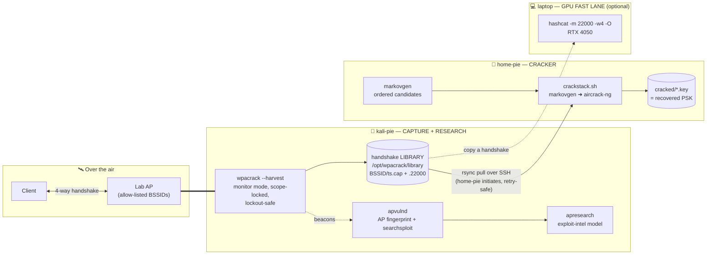
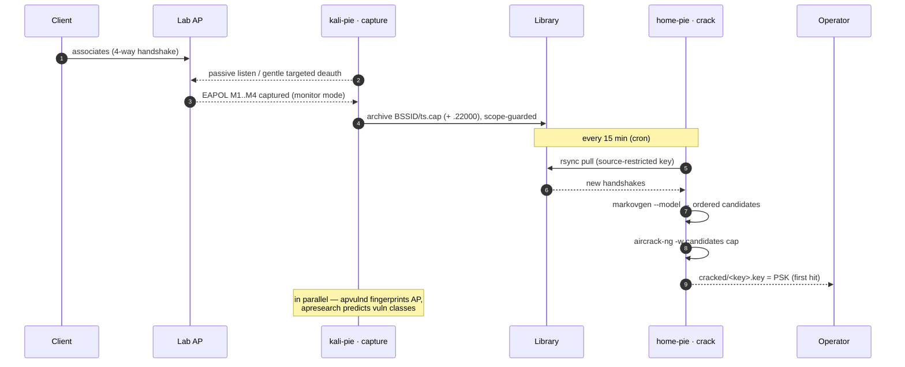
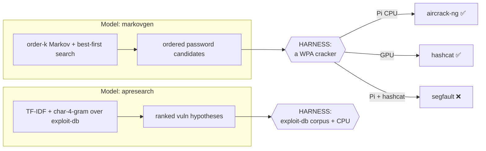
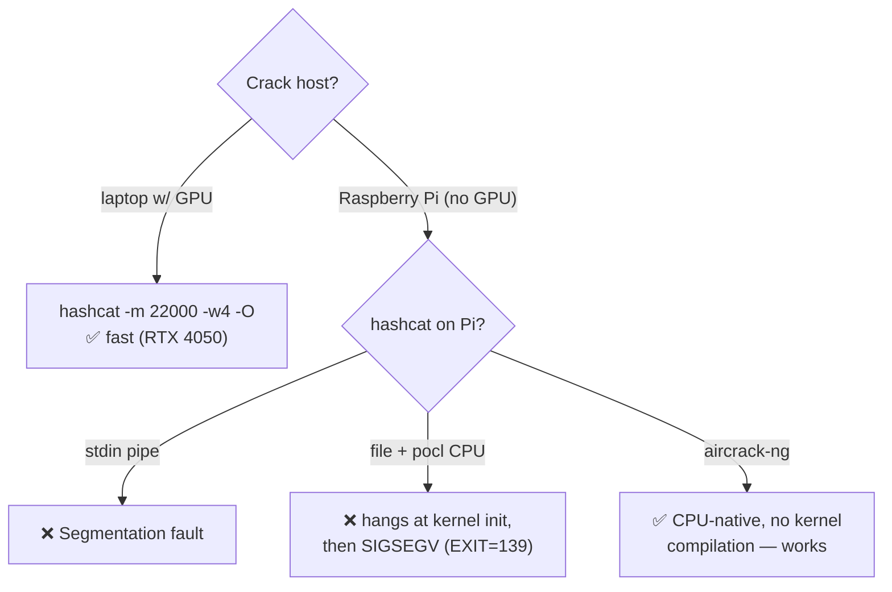
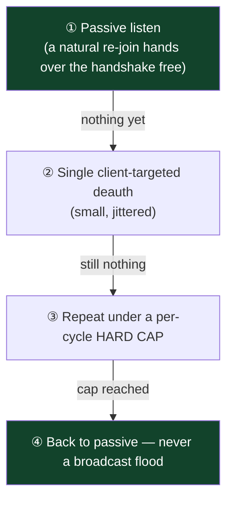
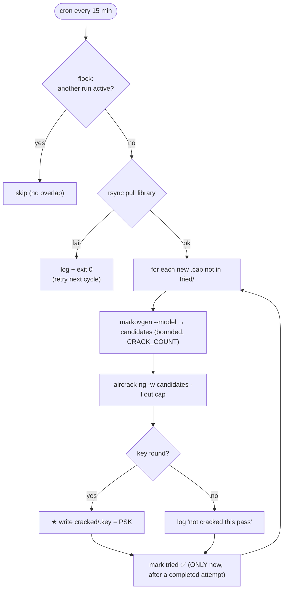
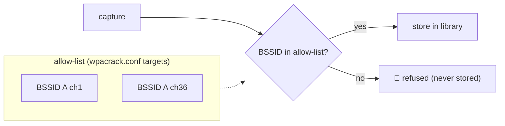
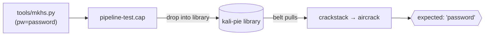

# 📡 Pipeline — Distributed WPA Capture → Crack → Research

A self-hosted, **authorized-lab** security pipeline that splits WPA testing across three machines,
each doing the workload it is actually good at, and moves small artifacts (handshakes, fingerprints)
between them over SSH.

> ⚠️ **Authorized use only.** Every component is hard-scoped to the operator's own access point (a
> BSSID allow-list). This is a defensive / research tool for networks you own or are explicitly
> permitted to test. It performs **no online guessing and no WPS-PIN brute** — cracking is 100%
> offline, so it can never trip an AP lockout.

📖 **[`DESIGN.md`](DESIGN.md)** holds the deep theory; this README is the detailed, visual tour.

---

## Table of contents
- [Why split it across three machines?](#-why-split-it-across-three-machines)
- [Architecture at a glance](#-architecture-at-a-glance)
- [End-to-end data flow](#-end-to-end-data-flow)
- [The core theory: models need a harness](#-the-core-theory-models-need-a-harness)
- [Why aircrack-ng and not hashcat on the Pi](#-why-aircrack-ng-and-not-hashcat-on-the-pi)
- [Component deep-dives](#-component-deep-dives)
- [The no-lockout escalation ladder](#-the-no-lockout-escalation-ladder)
- [crackstack internal logic](#-crackstack-internal-logic)
- [Scope & security model](#-scope--security-model)
- [Repository layout](#-repository-layout)
- [Deploy & run](#-deploy--run)
- [Testing end-to-end](#-testing-end-to-end)
- [Status matrix](#-status-matrix)
- [Roadmap](#-roadmap)

---

## 🧩 Why split it across three machines?

Cracking WPA is really **three different workloads**, and one box is rarely good at all three:

| Workload | Wants | Poor fit | Placed on |
|---|---|---|---|
| **Capture** a 4-way handshake | monitor-mode radio, RF proximity, patience | a rack GPU | **kali-pie** (capture appliance) |
| **Crack** the handshake | raw compute — WPA2 = PBKDF2-HMAC-SHA1 ×4096 | a headless Pi CPU | **home-pie** (Pi) + **laptop GPU** (fast lane) |
| **Research** the AP's vulns | an exploit corpus + spare CPU for inference | any host without the data | **kali-pie** (relocatable) |

The pipeline puts each workload where it belongs and ships only tiny artifacts between hosts.

---

## 🗺️ Architecture at a glance



**Trust & transport:** home-pie **pulls** (it initiates) over SSH with a dedicated, passphrase-free,
**source-restricted** key authorized on kali-pie. Pull-model = survives home-pie being powered off,
and a dropped link just retries next cycle instead of losing data.

---

## 🔄 End-to-end data flow



---

## 🧠 The core theory: models need a harness

The system has **two models** — both pure, portable Python — but a model only produces *inputs*.
It needs a working **harness** on its host to turn those inputs into results:



**Takeaway:** picking the right harness *per host* is where the engineering lives — and where the
surprises were (below).

---

## ⚙️ Why aircrack-ng and not hashcat on the Pi

hashcat is the obvious cracker — but on a **GPU-less Raspberry Pi** it drives the CPU through `pocl`
(OpenCL), and that path is broken here:



| Attempt on the Pi | Result |
|---|---|
| `markovgen \| hashcat` (stdin) | **Segmentation fault** |
| `hashcat -m 22000 file` (pocl CPU) | stuck at *"Initializing device kernels…"*, then **EXIT=139** (SIGSEGV) even after 6 min |
| `aircrack-ng -w file cap` | ✅ **`KEY FOUND!`** (verified against a synthetic handshake) |

➡️ **Decision:** `aircrack-ng` is the Pi's harness; `hashcat` stays on the GPU fast-lane.

---

## 🔬 Component deep-dives

### 1. `wpacrack --harvest` — capture appliance (kali-pie)
| Property | Detail |
|---|---|
| Mode | Sets monitor mode **once** and holds it (bouncing NetworkManager per cycle previously wedged the Pi's SSH) |
| Scope | Only allow-listed BSSIDs; `archive()` **refuses** any other BSSID — enforced in code |
| Politeness | Passive-first; then small, jittered, **client-targeted** deauth under a per-cycle hard cap; no floods |
| Output | `library/<BSSID>/<ts>.cap` (+ `.22000` via `hcxpcapngtool`), plus an index; idles when targets are fresh |

### 2. Conveyor belt — `crackstack` pull (home-pie)
`rsync` over SSH, **home-pie initiates**. Key is passphrase-free and `from="<home-pie IPs>"`
restricted on kali-pie (least privilege, one direction). `rsync` failure is non-fatal → retry next cron.

### 3. `crackstack.sh` — the Pi cracker (home-pie)
`markovgen` candidates → `aircrack-ng`. First-hit-wins. Hardened (see [logic](#-crackstack-internal-logic)).

### 4. `markovgen` — candidate model → [Markovgen-Model](https://github.com/Blitswolf/Markovgen-Model)
Order-k character Markov model + **best-first (uniform-cost) search** = candidates in *descending
probability order*; generates novel plausible passwords a static list can't, respects WPA's 8-char
minimum, seedable.

### 5. `apresearch` — exploit-intel model → [Apresearch-Model](https://github.com/Blitswolf/Apresearch-Model)
When `searchsploit` finds nothing, it reasons over the **whole** exploit-db (TF-IDF + char-4-gram)
→ nearest analogues → predicted vuln classes → mined endpoint/param/payload **test plan**. Runs
continuously at low priority to use spare CPU.

### 6. `apvulnd` — AP recon (kali-pie)
Hourly: fingerprints the AP from beacons (vendor / WPS / RSN / PMF / cipher), runs `searchsploit`,
feeds `apresearch`, and — only when the AP mgmt IP is reachable — a bounded **non-destructive**
sweep. Recon only; no brute.

---

## 🛡️ The no-lockout escalation ladder

Capture escalates gently and can **never** trip an AP lockout (no online guessing anywhere):



Cracking is **entirely offline** → the AP is never sent a single password guess.

---

## 🧷 crackstack internal logic

The hardening that makes it *immaculate* for unattended operation:



> 🔑 **The critical fix:** `tried` is marked **only after a completed attempt**. An earlier version
> marked it *before* cracking, so any crash / kill / reboot mid-crack silently burned the handshake
> forever. Now a crashed run leaves it un-tried and it is retried next cycle.

---

## 🔐 Scope & security model



- Capture is allow-listed **and** the archiver refuses off-list BSSIDs.
- No online password guessing, no WPS-PIN brute → no lockout, anywhere.
- Cross-host trust: one-directional, passphrase-free, **source-restricted**, least privilege.
- **Nothing sensitive is committed** — real configs, captures, keys, and models are git-ignored.

---

## 🗂️ Repository layout

```
Pipeline/
├── DESIGN.md                      architecture, theory, proven/limited status
├── README.md                      this file
├── capture/                       kali-pie
│   ├── wpacrack.py                  single-shot + --harvest continuous library mode
│   ├── wpacrack-harvest.service     systemd unit
│   └── wpacrack.conf.example        site config (allow-list, library, cooldown) — placeholders
├── crack/                         home-pie
│   └── crackstack.sh                pull → markovgen → aircrack-ng, hardened
├── research/                      kali-pie (relocatable)
│   ├── apresearch.py                exploit-intel model
│   ├── apresearch.service           continuous low-priority service
│   ├── apvulnd.py                   AP fingerprint + searchsploit + discovery
│   ├── apvuln.service
│   └── apvuln.timer
└── tools/
    └── mkhs.py                      synthetic WPA2 handshake generator (for e2e testing)
```

`markovgen` lives in its own repo and is deployed alongside `crackstack.sh` on the cracker.

---

## 🚀 Deploy & run

**Capture (kali-pie):**
```bash
sudo install -m755 capture/wpacrack.py /opt/wpacrack/wpacrack.py
sudo cp capture/wpacrack.conf.example /opt/wpacrack/wpacrack.conf   # edit: your AP allow-list
sudo cp capture/wpacrack-harvest.service /etc/systemd/system/
sudo systemctl enable --now wpacrack-harvest        # monitor-mode capture into the library
```

**Cracker (home-pie):**
```bash
mkdir -p ~/crackstack/model
cp crack/crackstack.sh ~/crackstack/ && chmod +x ~/crackstack/crackstack.sh
# + markovgen.py and a trained model into ~/crackstack/{,model/}
crontab -l | { cat; echo "*/15 * * * * /home/labs/crackstack/crackstack.sh"; } | crontab -
```

**Research (kali-pie):**
```bash
sudo cp research/apresearch.py research/apvulnd.py /opt/apvuln/
sudo cp research/apresearch.service research/apvuln.service research/apvuln.timer /etc/systemd/system/
sudo systemctl enable --now apresearch.service apvuln.timer
```

**GPU fast-lane (laptop):**
```bash
hashcat -m 22000 -w4 -O <handshake.22000> <wordlist>      # orders of magnitude faster than a Pi
```

---

## 🧪 Testing end-to-end

`tools/mkhs.py` builds a **valid synthetic WPA2 4-way handshake** for a chosen password (default
`password`, ESSID `PIPELINE-TEST`) — no real client needed:



Verified locally: `aircrack-ng` cracks the generated handshake → `KEY FOUND! [ password ]`.

---

## 📊 Status matrix

| Component | State | Notes |
|---|---|---|
| Capture appliance (harvest) | ✅ working | headless, scope-locked, lockout-safe |
| Conveyor belt (pull) | ✅ working | source-restricted key, retry-safe (when link is up) |
| aircrack harness | ✅ proven | cracks synthetic handshake → `password` |
| apresearch model | ✅ working | 47k-entry index, vuln-class predictions |
| **home-pie Wi-Fi link** | ⚠️ unreliable | drops frequently → **put home-pie on Ethernet** |
| **markovgen on a Pi** | ⚠️ slow | 340k-context model load+gen is heavy on ARM → use a smaller model / pre-gen lists |
| hashcat on a Pi | ❌ unusable | pocl CPU kernel-init segfault → aircrack instead |
| live single-shot crack | ⏳ pending | blocked only by the two ⚠️ items above |

---

## 🧭 Roadmap
1. **home-pie → Ethernet** (kills the link-reliability caveat).
2. **Lighter model on the Pi** (lower order / pruned, or pre-generated candidate lists) for practical
   generation speed.
3. Full **live single-shot** end-to-end demo once (1) and (2) land.
4. Optional: relocate `apresearch` onto home-pie to scale the research side.
5. Commit `markovgen.py` + a refined `crackstack` here after the clean live run.

---

*Related: [WPAcrack.py](https://github.com/Blitswolf/WPAcrack.py) ·
[Markovgen-Model](https://github.com/Blitswolf/Markovgen-Model) ·
[Apresearch-Model](https://github.com/Blitswolf/Apresearch-Model)*
